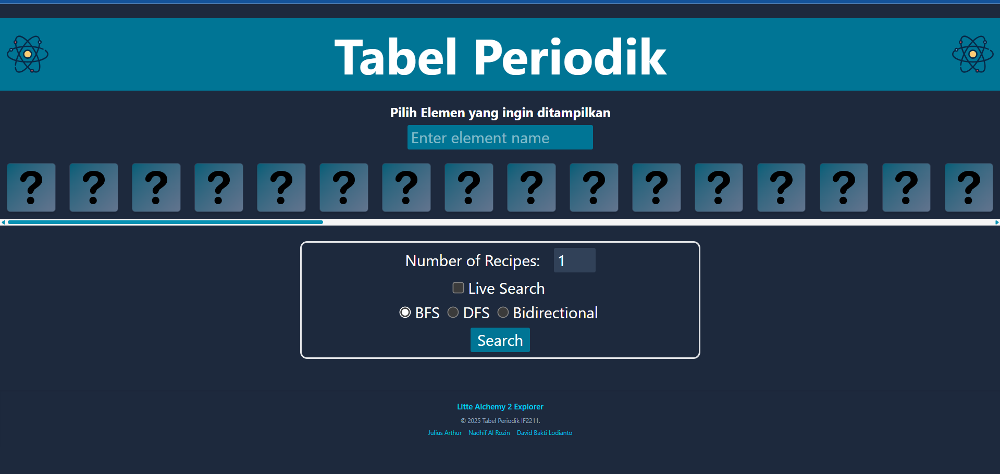

# 🔬 Tubes2_FE_tabelPeriodik

Sebuah web interaktif untuk mencari resep elemen dalam game **Little Alchemy 2** yang berdasarkan input dari pengguna. Web ini memungkinkan pengguna untuk menemukan kombinasi bahan-bahan untuk menciptakan suatu elemen, menggunakan berbagai metode pencarian seperti **DFS**, **BFS**, dan **Bidirectional Search**.

## ✨ Fitur

- 🔍 **Pencarian Resep**  
  Masukkan nama elemen yang ingin kamu buat bisa 1 atau banyak resep, dan web akan menampilkan resepnya berdasarkan elemen-elemen dasar.

- 🧭 **Metode Pencarian**  
  Tersedia beberapa algoritma pencarian:

  - **Depth-First Search (DFS)**
    Metode yang mencari element di sisi kiri tree terlebih dahulu hingga dead-end dan melakukan backtrack
  - **Breadth-First Search (BFS)**
    Metode yang mencari element secara merata di suatu tier terlebih dahulu kemudian turun ke tier selanjutnya
  - **Bidirectional Search** 
    (**Left** adalah pencarian dari elemen dasar ke tujuan (ditandai warna **Biru**), **Right** sebaliknya (**Putih**))

- ⚡ **Live Update Mode**  
  Menampilkan proses pencarian secara real-time dengan kecepatan yang bisa diatur sesuai preferensi pengguna.

## 🛠️ Teknologi

- ⚛️ **React.js** dengan [Vite](https://vitejs.dev/)
- 🎨 **Tailwind CSS** untuk styling
- 🐳 **Docker** untuk containerization

## 🚀 Cara Menjalankan

### 1. Clone Repository

```bash
git clone https://github.com/Narrr21/Tubes2_FE_tabelPeriodik.git
cd Tubes2_FE_tabelPeriodik
```

### 2. Jalankan dengan Docker

Pastikan Docker sudah terinstal.

```bash
docker build -t littlealchemy-fe .
docker run -p 8080:3000 littlealchemy-fe
```

## 📁 Struktur Direktori Utama

```
├── public/             # Asset statis
├── src/                # Kode sumber utama
│ └── assets/           # Asset SVG
├── .env                # Variabel lingkungan
├── Dockerfile          # Konfigurasi Docker
├── README.md           # Dokumentasi ini
├── eslint.config.js    # Konfigurasi ESLint
├── index.html          # Template HTML utama
├── package-lock.json   # Lockfile npm
├── package.json        # Konfigurasi dependensi proyek
└── vite.config.js      # Konfigurasi Vite
```

## 📸 Tampilan Antarmuka



## Author
- 13523030 Julius Arthur
- 13523076 Nadhif Al Rozin
- 13523083 David Bakti Lodianto
